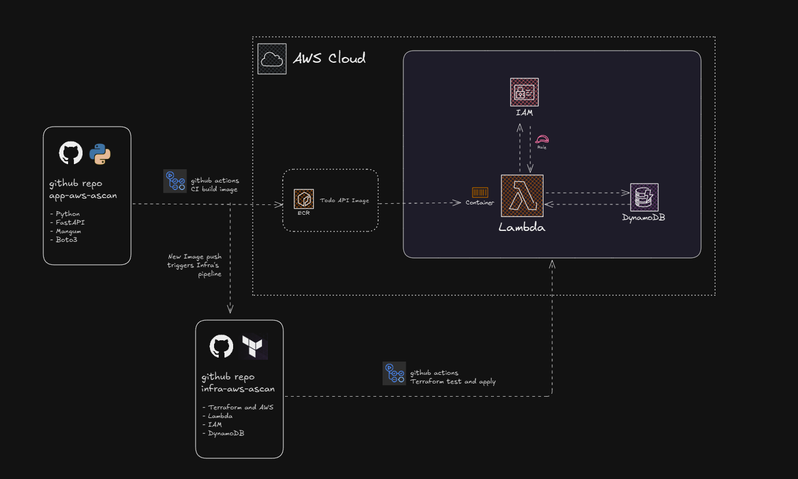

# AWS Ascan Infrastructure

This repository contains the infrastructure for the **AWS Ascan project**.

## Introduction

The AWS Ascan project aims to provide a scalable and efficient solution for automated security scanning in AWS environments.

This infrastructure is designed to be called from another CI/CD pipeline. Specifically, it's triggered by the image build pipeline that resides in the `vidalme/app-aws-ascan` repository. When a new container image is built and pushed, this infrastructure creates and manages a Lambda function that executes the security scanning container image.

This repository itself includes CI/CD pipelines that automatically build and deploy the entire infrastructure stack whenever changes are pushed to the main branch or a new image is built in app-aws-ascan pipeline, ensuring the infrastructure is always up to date.

## Architecture

The infrastructure is built using AWS services such as:
- AWS Lambda - Runs the container image for security scanning
- Lambda Function URL - Provides HTTP endpoint access to the Lambda function, creating a complete API
- DynamoDB - Contains a single table for storing scan results and configuration data
- IAM - Includes necessary roles and policies for the Lambda function to interact with other AWS services
- ECR - Stores the container images used by the Lambda function
- CloudWatch - Monitors and logs the Lambda function execution

The Lambda function operates as a complete API, accessible via its Function URL. The DynamoDB table stores all data from the app running in the lambda, while the IAM roles ensure the Lambda has appropriate permissions to perform its database operations.

